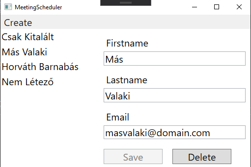
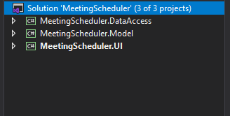
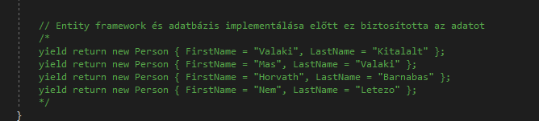

# Szoftverfejlesztési technológiák - Nagy beadandó - Meeting Scheduler - by: Horváth Barnabás
## Célkitűzés
Ebben a projectben a célom az volt, hogy lépésről lépésre felépítsek egy **WPF** applikációt **C#** nyelven. A projectem elején készítettem egy "project csontvázat", ami képes volt nagyon alap funkciókra, és innen bővítgettem tovább az applikációt a fejlesztés során. 
## Ötlet
A project mögötti elképzelés az volt, hogy egy cég belső hálózatára lett tervezve, és meeting-ekhez lehet embereket hozzáadni névvel és e-mail címmel.

## Mire képes a program
A végső verzió tartalmaz pár alap **Person** bejegyzést, amik láthatóak az appon. A program **CodeFirst** megközelítést használ, ezért nem kell adatbázis felépítéssel külön foglalkoznunk, a program erről is gondoskodik, csak egy működő **MSSQL Server** kell. 
Az app képes kilistázni, milyen bejegyzések vannak a táblában, ez a bal oldali lista nézetben lesz látható. 
Ha itt kiválasztunk egy **Person**-t, akkor jobb oldalon ki fogja írni a vele kapcsolatos adatokat. 
Az adatokat **módosíthatjuk**, ha akarjuk, ezt az app az adatbázisba is el fogja menteni. 
Az app alkalmaz **input validációt**, a nem nullable mezőket kötelező kitölteni, különben nem engedi elmenteni a módosításokat, van meghatározott maximum hossz, és azt is megnézi, hogy az email valid email formátumú legyen. Ha módosításokat végeztünk, de megpróbálunk elkattintani, akkor az app jelezni fog, hogy módosítás történt, és el fogjuk azt veszíteni ha folytatjuk az elkattintást.
**Törölhetünk** is bejegyzést, ha szeretnénk, erre is megerősítést kér az app a felhasználótól, hogy véletlen törlések ne forduljanak elő.
Végül pedig **hozzá is tudunk adni** új bejegyzést az adatbázishoz és az apphoz, ezt az ablak tetején található **Create** menüpontra kattintást követően a **New Person** almenüre kattintással tudjuk megtenni.
Összességében az appal a teljes **CRUD** skálát bejárjuk, mert az abban található műveletek közül mindegyiket tudja az alkalmazás.

A befejezett project kinézete:



## Fejlesztés szempontjából fontos pontok
A project megvalósítása során követtem az **MVVM** (Model View ViewModel) design pattern-t. Bár az adatbázis kommunikáció viszonylag egyszerű, a **WPF**-ben rengeteg funkciót megvalósítottam, ami a projectet elég méretesre növelte, és bonyolulttá tette. Az adatbázis kommunikáció az előírtak szerint **Entity Framework** segítségével lett megoldva, aminek egy **MSSQL Server**-re van szüksége backend adatbázisként.

# A fejlesztési folyamat

## 1. Előkészületek, alapok
Első lépésként az **MVVM** alapján megterveztem, hogy a project nagyjából hogyan legyen struktúrálva. 3 **class library**t haszáltam a project során:
- MeetingScheduler.**DataAccess**
- MeetingScheduler.**Model**
- MeetingScheduler.**UI**



Itt a **DataAccess** az, amelyik az adatbázis elérésért felelős, ez szolgáltatja az adatokat a **ViewModel**-ek számára. Itt helyezkedik el az **Entity Framework**-ös kódrészlet.
A **Model** tartalmazza a modell-eket, a project végére 2 darabot, 1 "fő" modellt és egy "kisegítő" modellt.
A **UI** rengeteg dolgot tartalmaz, de a legfontosabbak számunkra a **ViewModel**-ek és a **View**-ek.

Fontos! A class library-k nem az **MVVM** pattern alapján lettek szétválasztva, hanem logikai elgondolásból. Az **MVVM** pattern-t a class library-kon belül alkalmaztam.

Első lépésként tehát létrehoztam ezeket a class library-kat, és létrehoztam a **Person** modellünket, aminek adtam 3 mezőt: 
- egy **FirstName**-t 
- egy **LastName**-t 
- és egy **Email**-t

**FONTOS!!** hogy következő lépésben beállítsuk a referenciákat, hogy megfelelően működjenek együtt a class library-k:
- A **DataAccess** -be állítsunk be egy referenciát a **Model** -re
- A **UI** -ba állítsunk be egy referenciát a **DataAccess**-re és a **Model**-re is

## 2. Alap UI felépítése
Ha ezek megvoltak, az alapokat lefektettem. Ezt követően építettem egy **UI** csontvázat, egyelrőre adatbázis kommunikáció és minden egyéb nélkül. Pont emiatt, kellett készítenem egy **"fake" DataService**-t, ami úgy csinál, mintha adatbázissal dolgozna, de igazából **hardcoded elemek**et szolgál ki. Ez természetesen csak egy ideiglenes megoldás volt.

Először is létrehoztam egy új mappát a **UI** alá, hogy struktúráltabb legyen minden. Ez a **Data** nevet kapta. Ebbe csináltam egy classt, aminek a feladata adat szolgáltatása volt (ez a végső projectben át lett alakítva azóta). 
Az itt implementált adat szolgáltatást benne hagytam a kódban kikommentelve, csak hogy meglegyen az, hogy honnan indult ki az egész. Ekkor még **`IEnumerable<Person>`** adattipus az, amit visszaadott ez a szolgáltatás.



Ezt követően készítettem egy interface-t az osztályból. Tehát a Model-ben van a Person és a property-jei, a **ViewModel** fel fogja ezt használni a **DataService** segítségével, hogy betöltse a **Modelt**. 
Ennek a DataService-nek a feladata, hogy olyan módon biztosítsa az adatot a ViewModel részére, ahogy annak szüksége van rá.

Következő lépésként csináltam egy **ViewModel** mappát is a **UI** alá, ide kerültek a ViewModel-ek, egyelőre csak a **MainViewModel**. Ebbe tettem egy **`ObservableCollection<Person>`** tipusú **People** propertyt, ez az adattipus tökéletes lesz nekünk, hiszen lehet figyelni, hogy változik-e, ami egy fontos tulajdonság egy ilyen applikáció során. Ezt az **INotifyCollectionChanged** interface segítségével oldja meg ez az adattároló tipus. 
Implementáltam még egy **Load()** függvényt, ami képes volt a már elkészített **DataService** segítségével feltölteni ezt a **People** tárolónkat úgy, hogy a class consturctorban átvettem a **DataServiceInterface**-t, majd meghívtam az előzőleg megírt függvényt ami ilyen **"fake" DataService**-ként működik, ezt eltároltam egy változóban, majd ezen végiglépkedve egy **foreach**-el hozzáadogattam az elemeket a **People**  **`ObservableCollection<Person>`** tárolóhoz. Emellett az egész **Load()** elején le **Clear()**-eltem a tárolónkat, hogy ne legyenek duplikátumaink. 

Ezt követően készítettem még egy **SelectedPerson** property-t, hogy az ablakunkban majd ha kiválasztunk egy Person-t, akkor annak az adatait ki tudjuk írni. Ennek a setter-jében kellett implementálni valamit, ami jelezni fog a data bindingoknak, hogy megváltozott a kiválasztott **Person**. Erre az **INotifyPropertyChange** -t implementáltam a **MainViewModel** class-ra. Ehhez készítettem egy függvényt, aminek a neve **OnPropertyChanged()**, és azt nézi, hogy a property megváltozik-e. A **[CallerMemberName]** attribútum használata egy jókis trükk itt, mert ezzel automatikusan megkapja a függvény híváskor paraméterként, hogy melyik property hívta, és a property névre szüksége van a **PropertyChanged.Invoke**-nak, ami jelezni fogja a property változást.

Mivel több ViewModel is került a programba később, így végső állapotban ez a property változás vizsgálat át lett téve a **ViewModelBase** nevű fileba, így ez implementálja az interface-t és ebben van a vizsgáló kód, a **MainViewModel** pedig leszármazottja ennek a **ViewModelBase**-nek. A **SelectedPerson** setterjében simán csak meghívtam ezt az **OnPropertyChanged()** -et, és így megvan a várt működés, változáskor, "set"-eléskor jelezve lesz a property változás. 

Ezek után kellett a View-et alakítanom, ebben először csináltam egy **EventHandler**-t, ami meghívja a **ViewModel** **Load()** függvényét. A **MainWindow** természetesen átvett egy **MainViewModel**-t ahhoz, hogy ez működjön. 

Ezt követően sima **xaml**-ban terveztem egy nagyon egyszerű alkalmazás layout-ot, bal oldalon egy listával ami listázza a neveket, jobb oldalon pedig a "részletes" megjelenítéssel. Ez is át lett alakítva a végső programban később, de itt ListView-vel oldottam meg a lista nézetet bal oldalon, az **ItemSource**-t a **People**-hez bindoltam, a **SelectedItem**-et pedig a **SelectedPerson**-hoz. A "jobb oldalt" azaz a részletes nézetet **Grid**-del és bele helyezett mezőkkel oldottam meg, **Label**-ekkel és **TextBox**-okkal, amikben létrehoztam **Binding**-okat a **ViewModel**-ünkhöz. Ez alapján született egy egyszerű layout.

Az egyszerűbb dependency kezelés miatt úgy döntöttem, hogy az **Autofac** nevű Dependency Injection könyvtárat használom. Ehhez fel kellett tenni a **UI** class libraryba az **Autofac NuGet Package**-t. Az ehhez kapcsolatos fileokat egy új mappába, a **Startup** nevű mappába tettem, amit a **UI** project-be készítettem. Ebbe egyetlen file került, egy **Bootstrapper.cs**, ez tartalmazza az **Autofac**-es dolgokat. Ahhoz hogy ezt használni tudjuk, kellett egy függvény ami egy **IContainer**-t ad vissza, ezt én **Bootstrap()**-nak neveztem el. Itt létrehozunk egy új **ContainerBuilder**-t, majd regisztrálgathatjuk a tipusainkat. Ennek a segítségével ha egy **IPersonDataService**-re van valahol szükség, akkor az **Autofac** fog csinálni nekünk egy **PersonDataService** instance-t. A **MainViewModel**-t és a **MainWindow**-ot is regisztráljuk. A legvégén meg kell hívni a **Build()** függvényt a konténerre és return-ölni, és működik is a dolog. Az **App.xaml.cs** fileban csináltam egy ilyen **Bootstrappert**, majd ezzel egy konténert, innentől kezdve a container.Resolve-val megoldható bármi dependency, ha az regisztrálva van (így a mainWindow dependecyjei is). Így a **View** konstruktorába beleinjektálja a **ViewModelt**, a **ViewModel** konstruktorába pedig a **DataService**-t.

## 3. Az Entity Framework beépítése a programba

A következő lépésben implementálni kellett az **EntityFramework**-öt, hogy ne a **"fake" DataService**-ünk adja az adatot a **ViewModel** számára, hanem egy tényleges adatbázis. Én a **CodeFirst Migration** megközelítést választottam, ami annyit takar, hogy mi a C# kódunkból generáltatjuk le az **EntityFramework** segítségével az adatbázist és a táblákat is. 

Mindent a **DataAccess** class library-ban valósítottam meg, hiszen ez felelős az adatelérésért (nevéből is adódik). Első lépésként hozzá kell adni magát az **EntityFramework NuGet Package**-t a referenciákhoz. 

EntityFramework Code First-hez kell egy DbContext class, ezt én MeetingSchedulerDbContext-nek neveztem el. Ezt a DbContext-ből származtattam. Itt beállítottam, hogy ne tegye többesszámba a táblaneveket az EntityFramework. Ezután egy nagyon fontos rész jön, mivel ezt, ha másik gépen futtatjuk az appot, akkor át kell írni: a connection string hozzáadása az **App.config** -hoz:
```	
<connectionStrings>
	<add name="MeetingSchedulerDb"
		connectionString="Data Source=DESKTOP-29S8MUB\SQLEXPRESS; Initial Catalog=MeetingScheduler; Integrated Security=True"
		providerName="System.Data.SqlClient"/>
</connectionStrings>
  ```

Itt a **Data Source**-t át kell írni a helyi **SQL Server** nevére ahhoz, hogy a kapcsolat megfelelően létrejöhessen az adatbázis szerverrel.

Itt egy jó dokumentáció a következő pár lépésről: [Code First Migration Entity Frameworkkel](https://www.entityframeworktutorial.net/code-first/code-based-migration-in-code-first.aspx)

Ha mindez megvan, akkor a NuGet konzolban engedélyezni kell a Migrations-t, hogy működjön a Code First megközelítés. Ezt az **Enable-Migrations** futtatásával tudjuk megtenni. Ne felejtsük el a megfelelő project kiválasztását, a **DataAccess**-t, ha nem azt hoztuk létre elsőnek. Ez csinált egy **Migrations** nevű mappát a **DataAccess** projectünkbe, és ebbe egy **Configuration.cs** filet. Itt tudjuk beállítani, hogy alapból mivel legyen feltöltve az adatbázis. 

Ezek után az **Add-Migration** parancsot kell futtatni, ez lényegében "felveszi" a model változtatásait. Ezután az **Update-Database**-vel tudjuk majd ténylegesen belerakni a változásokat az adatbázisba. Ez generált nekünk egy filet, ebben benne vannak az entity frameworkos szintaktikával íródott kódrészletek, amik az adatbázis változtatásokat elvégzik. 

Mielőtt még lefuttatnám az **Update-Database**-t, beállítottam pár adat megszorítást, azaz DataAnnotation-t, hogy ne lehessen bármilyen adatot beletenni az adatbázisba. Ezt a **Model**-ben oldottam meg a **System.ComponentModel.DataAnnotations** használatával, ahol meg lehet adni ilyeneket, mint pl.: 
- **[StringLength(50)]** 
- **[Required]**
stb.
Mivel változtattam a modellen, amit felhasznál az adatbázis, megint futtatni kell az **Add-Migration**-t. Kell neki a **-Force** paraméter is, mert a modell nem változott, csak az adatmegszorításokat adtuk hozzá. 

Ezután megpróbáltam az **Update-Database**-t futtatni, de mivel én a **UI**-t hoztam létre előszőr, és ez a **Startup Project**-em, így gondba ütköztem. A gond az, hogy a connection stringet a startup projectben keresi az **EntityFramework**, és a **UI** project **App.config**-jában ilyen nincs. Ennek kiküszöbölésére, simán csak átmásoltam a **connection string**-et a **UI App.config**-jába is.

**TEHÁT FONTOS!!** Ha futtatni próbáljuk az appot, még egy hely lesz, ahol át kell írni a szerver nevet.

Ha ez is megvan, sikeresen le kell futnia az **Update-Database** parancsnak, és **SQL Management Studio**-val, vagy **Visual Studio**-n belülről ellenőrizhetjük az adatbázis és a táblák létrejöttét. 

VS-ben:
```
View -> Server Explorer -> Data Connections (jobb klikk) -> Add Connection -> Server Name-t kitölteni -> Kiválasztani az adatbázist -> Kész, innentől látjuk az adatbázis elemeket
```

Következőnek hozzáadtam az **Entity Framework**-ot a **UI** projecthez is, hogy működjön a **DataService** amit pedig átalakította, hogy tényleg az adatbázisból kérje le az adatokat a **"fake" DataService** helyett. Ekkor még lekértem az összes bejegyzést az adatbázisból, ez azóta át lett alakítva, mert úgy lett megoldva a program, hogy csak annak a részleteit kérje le, akire rákattintunk. Itt ismét használtam az **Autofac**-et, hogy a **MeetingSchedulerDbContex**-et beinjektálja ebbe a classba.

Végső lépésben úgy döntöttem, hogy **Async**-re alakítom az adattöltést, hogy reszponzív legyen a felület, és ha váltogatunk a kiválasztott ember között, akkor ne kelljen várni a töltésre. Ehhez csak át kellett írni pár tipust és függvényt. A **ViewModel**-ben is átalakítottam a **GetAll()** -t asyncre, ls ezzel a **Load()** függvényt is. Ezt követően a **MainWindow** **CodeBehind**-jában is át kellett alakítani a függvényt async-re, mert itt is van töltés. Lényegében mindenhol meg kell ezt tenni, ahol előfordul. 

Ebben az állapotban volt egy teljesen működő appom, ami képes **Async** módon egy adatbázisból **Entity Framework** segítségével elemeket betölteni, és ezt **MVVM Pattern**-t követve valósította meg.

## 4. A UI átszervezése okosabb struktúrára

A következő tervem az volt, hogy a **UI** két elemét, a bal oldali **Lista View**-t és a jobb oldali **Detailed View**-t kettészedjem, mert teljesen más a kettő, és mert így lightweight-ebbé lehet tenni az appot, ha az összes Person helyett csak mindig azt töltöm be, amelyik ki van választva. 

A terv az, hogy legyen egy **NavigationViewModel** ami a bal oldali rész ViewModel-je, és legyen egy **PersonDetailViewModel**, ami pedig a részletes nézetért felelős. Ezekhez az új View modellekhez kell új View is. Emellett a jelenlegi **DataService**-t is át kellett alakítanom, hogy ne szolgáljon ki teljes **Person** elemeket, hanem csak egy **Name**-t és egy **Id**-t, mert ez elég a **NavigationView**-hez. Emellett a **PersonDataService**-t is át kell alakítani, hogy csak 1 **Person**-t adjon vissza, mégpedig azt, amit kiválasztunk, mondjuk **Id** segítségével. 

Első lépésben hogy ez meg is valósuljon, kellett egy új elemet adni a **Model**-hez, mert olyan elemünk amit vissza kéne adni, még nem létezik. Ezt **LookupItem**-nek neveztem el. Ennek lesz egy **Id**-je és egy **DisplayMember** property-je, ami az, amit megjelenítünk a navigációs nézetben. 

A következő lépés az adat szolgáltatás átalakítása volt, így csináltam egy **Lookups** mappát a már meglévő **Data** mappába a **UI** projecten belül, majd ebbe egy **LookupDataService**-t. Ez annyit csinál, hogy visszaad egy **IEnumerable** listát az adatbázisból lekérdezgetve, aminek az elemei **LookupItem** tipusuak, azaz van egy **Id**-jük és egy **DisplayMember** elemük, amit a **FirstName** és **LastName** összefűzéséből kaptam. Ha ez megvan akkor a class elkészült, képes arra amit szeretnénk, így készítettem belőle egy **Interface**-t, majd ezt regisztráltam az **Autofac**-nél. 

Következőnek csináltam egy **NavigationViewModel**-t, amit a "bal oldali" **NavigationView**-nél fogok használni. Ebből készítettem egy interface-t, majd regisztráltam az **Autofac**-nél. A **MainViewModel**-emet teljesen kiürítettem és átalakítottam, hogy felkészítsem az új **ViewModel**-ek kiszolgálására. Tettem bele egy **LoadAsync()** függvényt, ami képes a **NavigationViewModel**-t betlöteni aszinkron módon. 

Ha ez is megvan, akkor a következő lépés a **NavigationView** elkészítése volt. Ehhez csináltam egy új mappát a **UI**-ba ismét, hogy a **View**-jeink is szépen legyenek struktúrálva. A MainWindow-ból kiszedtem a benne lévő **ListView**-t, és helyette beletettem az új **NavigationView**-et, a **NavigationView**-be pedig beletettem a **ListView**-t. Ezek után mikor elindítottam az appot, az képes volt a már szeparált **UI View** modulok segítségével betölteni az ablakot, annyi volt a gond, hogy az átalakítás miatt elveszett a **DetailView** nézetem, de ennek a javítása volt a következő teendő.

Ahhoz hogy működjön újra a **DetailView**, a **DataService**-t kellett átalakítanom, hogy **Id** alapján kérjen le egy **Person**-t az adatbázisból, ezt meg is tettem. 

Következőnek létre kellett hoznom egy **PersonDetailViewModel**-t, ami a "jobb oldali" **UI** szegmensért felelős. Ebben lényegében volt egy **LoadAsync()** ami betöltötte a kiválasztott **Person**-t, illetve egy **Person** mezőt, ami jelezte az **OnPropertyChanged()**-el, hogy változás történt. Ebböl aztán készítettem egy interface-t, és regisztráltam ezt is **Autofac**-ben. A **MainViewModel**-ben ezt is átvettem, és készítettem hozzá egy propertyt. 

Következő lépésként kellett ennek is egy **View**-t készíteni. Ezt meg is csináltam a **View** mappába, majd ezt belecsatoltam a **MainWindow**-ba. Ezután elindítva az appot, végre betöltött újra a teljes Layout-unk, de a Person kiválasztás még nem működött, mert nem hívta meg semmi a **LoadAsync()** függvényt amit a **PersonDetailViewModel**-be tettem. Újabb "nagyobb" gond következett, valahogy kommunikálnia kell a két **ViewModel**-emnek, ha a **NavigationViewModel**-ben kiválasztok valakit, akkor annak be kell töltődnie a **PersonDetailViewModel**-ben. Ez volt a következő nagy fejlesztési lépés.

## 5. Kommunikáció megoldása a ViewModel-jeim között

A probléma tehát ami fennállt ebben a helyzetben az volt, hogy a **ViewModel**-eknek valahogy kommunikálniuk kell egymással. Én ezt egy újabb **NuGet Package**-vel oldottam meg, a **Prism**-el, ami egy úgynevezett **EventAggregator**, és eventeket lehet vele létrehozni, illetve ezekre feliratkozni, azaz ez pont tökéletes erre a célra. A **NavigationViewModel** tehát **Publish**-olni fog egy eventet, amikor egy **Person** ki van választva. Erre a **PersonDetailViewModel** ezután **Subscribe**-ol, és így érzékelni fogja az event lezajlását.

Ahhoz hogy használhassuk a **Prism**-t, hozzá kell adni a **UI** referenciákhoz a **NuGet Package**-t. Én a **Prism.Core**-t használtam. Ezt követően a Prism-ben használt **EventAggregator**-t regisztráltam az **Autofac**-es **Bootstrapper** fileban. 

Ezt követően létre kellett hoznom az eventeket, ehhez csináltam egy új **Event** mappát a **UI** projectbe. Ebbe csináltam egy **OpenPersonDetailView** eventet, ami a nevéből is adódóan a **Person**-ra kattintáskor használatos. 

A következő lépés, hogy ezt **Publish**-oljuk a **NavigationViewModel**-ből. A **NavigationViewModel**-ben átvettem egy **eventAggregator**-t, az osztályt származtattam a **ViewModelBase**-ből, hogy tudjam használni az **OnPropertyChanged()**-et, majd létrehoztam egy **SelectedPerson property**-t, hogy érzékeljük, ha egy **Person** ki lett választva. Ezt a **NavigationView**-ban összekötöttem a **ViewModel**-el, majd ennek a setterében **Publish**-oltam az eventet. Így ha kiválasztottunk egy **Person**-t, **Publish**-olva lett az event. Ez az "oldala" a dolognak ezzel meg is van. Ezt a **Publish**-olást a **Person Id**-val tettem meg, hogy a **PersonDetailViewModel** megkapja, melyik **Id**-jű **Person** lett kiválasztva. 

Következőnek a **PersonDetailViewModel**-ban kellett feliratkozni, megfelelő szintaktikával **Subscribe**-olni az eventre. Ehhez itt is átvettem egy **eventAggregator**-t, ennek segítségével feliratkoztam az eventre, majd innen meghívtam a **LoadAsync()** függvényt, amit már megcsináltam régebben szintén a **PersonDetailViewModel**-ben. 

Ezek után az app ismét tökéletesen működik úgy ahogy azt elképzeltem, immáron szétszedett **ViewModel**-ekkel és **View**-okkal. 

## 6. Adatok mentése

Egy fontos dolog, amire még nem képes az app, az az írása az adatbázisnak. Kiolvasni már tud, de adatot elmenteni bele még nem. Ez volt a következő lépés, amit implementáltam. 

A mentéshez az **ICommand** interface-t használtam, ami képes a **View**-ban végzett cselekvésekre reagálni a **ViewModel**-ben. Szerencsére a **Prism**, amit már így is használok az eventekhez a **ViewModel**-ek közti kommunikáció során, rendelkezik egy **DelegateCommand** elemmel, ami lényegében egy ilyen **ICommand** implementálva. 

A **PersonDetailViewModel**-be létrehoztam egy **SaveCommand** property-t. Ezt egy **DelegateCommand**-ként definiálom, és csináltam hozzá 2 függvényt is, **OnSaveCanExecute()** és **OnSaveExecute()**. 

A **PersonDetailView**-ba adtam hozzá egy gombot, ami a mentésért lesz felelős. Ezt **Bind**-oltam a **ViewModel**-em **SaveCommand**-jához. Az **OnSaveCanExecute()** lesz azért felelős, hogy megnézze, hogy valid-e a beadott **Person**, de egyelőre csak true-t adtam vissza vele, hogy működjön a dolog. Ekkor meghívódik az **OnSaveExecute()**, ennek az implementálása volt a következő feladat. 

Ezt követően a **DataService**-ben hozzáadtam egy **SaveAsync()**-et, ami entity framework segítségével elmentette az adatokat az adatbázisba. Innentől kezdve működött a mentés, de a navigáció még nem frissült, így nem látszott "bal oldalon" a változás. Ennek a javítása jött következőnek. 

ezt megint csak egy **Event**-tel oldottam meg, hiszen ismét arra van szükség, hogy a **ViewModel**-ek kommunikáljanak egymással, és az **Event** már előzőleg is jó megoldásnak bizonyult. Ehhez az **Event** mappába csináltam egy **AfterPersonSaved** eventet. Ezt a **PersonDetailViewModel**-ben **Publish**-oltam, majd a **NavigationViewModel**-ben **Subscribe**-oltam rá. 

Utolsó lépésként az **INotifyPropertyChanged** interfacet kellett implementálni a dologba, hogy a **View**-ban frissüljön a **Data Binding**.  Ehhez csináltam egy új **ViewModel**-t, **NavigationItemViewModel** néven, ami a navigációban található elemek **ViewModel**-je. Ebben a **DisplayMember**-en implementálva van az **OnPropertyChanged()** függvény. Ezt az új **ViewModel**-t belekötöttem a **NavigationViewModel**-be. 

Innentől kezdve a **View**-ünk is frissülni fog, ha egy mentés történik.

## 7. Felhasználói bemenet ellenőrzése

Sajnos még mindig nem tökéletes az app, a legnagyobb jelenlegi gond vele az, hogy ha valaki olyan **Person**-t próbál meg elmenteni, aminek valamelyik mezője nem megfelelő az általam meghatározott adatbázis resztrikciók szerint, akkor a program crash-el, mert az **entity framework** nem fogja engedni az adatbázishoz adást.

Emiatt kellett implementálnom a felhasználó által beadott adatok validálását, de még azelőtt kellett ennek megtörténni, hogy az adatbázishoz megpróbáltam hozzáadni. 

Első lépésként adtam egy **DispatcherUnhandledException**-t a **UI** **App.xaml**-jéhez, ami a nem várt hibákat kezeli le. Ezt a **CodeBehind**-ban saját kóddal lekezeltem utána. 

A **WPF** appokban sokféle beépített adatellenőrzés van, én ezek közül az **INotifyDataErrorInfo** interface-t használtam, mivel utánajárás után ez az, ami aszinkron módon is képes működni. 

Egy kisebb gond adódott egyből: A **Model**-emre kellene implementálni a hibakezelést, mert ebben vannak benne az adatbázis elemek property-jei, de ehhez "el kell rontani" a modelt. Ezt úgy kerültem el, hogy "becsomagoltam" a modelt, és a **PersonDetailViewModel**-be implementáltam a dolgot, csak ehhez ugye kellenek a **Person** property-jei. 

Ehhez a csomagoláshoz, angolul **Wrap**-eléshez készítettem egy újabb mappát a **UI**-ba, **Wrapper** néven. Ebbe tettem a **PersonWrapper.cs**-t, ami a **Person** modelt fogja becsomagolni. Ebben lényegében csak elérhetővé tettem a **Model**-em elemeit. 

Ezek után a **PersonDetailViewModel**-ben átírtam a **Person**-t **PersonWrapper**-re, ott ahol kellett, és innentől ez a file a **PersonWrapper**-t használta. 

A következő lépés az **INotifyDataErrorInfo** implementálása volt. Úgy döntöttem, hogy a hibákat egy **Dictionary**-ben fogom tárolni, mert a kulcs-érték pár megközelítés tökéletes erre a célra. Így egy hiba névhez vagy tipushoz tárolható egy hiba üzenet. 
Ehhez adtam pár függvényt, amivel egyszerűen kezelhetővé válik a dolog: 
- **GetErrors()** - Hibák lekérésére
- **AddError()** - Hibák hozzáadására
- **OnErrorsChanged()** - Hiba dictionary változását nézi, ha változik, meghívja az eventet ami kell
- **ClearErrors()** - Hibák törlésére

Miután ez mind megvolt, következett a logika hozzáadása és a dizájn.
Az **App.xaml**-ben a **UI** projecten belül beállítottam a **Application.Resources** fülek között, hogy ha hiba van, akkor legyen piros a mező, és írja ki a mező alatt a hibát, illetve tooltip-ben is írja ki, hogy mi a hiba. 

Első körben, mivel logikailag nem igazán illik a **PersonWrapper**-be a hiba kezelését végző kód, kitettem egy új class-ba, amit **NotifyDataErrorInfoBase**-nek neveztem el. 

Következőnek készítettem egy új **ModelWrapper** osztályt, külön fileban, és ezt származtattam a **NotifyDataErrorInfoBase**-ből, ebből pedig a **PersonWrapper**-t. Ez azért jó, mert így a **PersonWrapper**-ünk majdhogynem olyan mint egy model, és a bonyolult logika mind a **ModelWrapper**-be kerül. A **ModelWrapper**-be vannak a függvények, a **PersonWrapper** csak hívja ezeket az adateléréshez. Ezzel megint restruktúrálva lett az app egy része, és logikailag sokkal átláthatóbb a dolog.

Ezután tehát a logikát kellett megírni, valahogy a **Person** **Model**-ben lévő szabályokat kell validálni a **UI**-ban is. Ez szerencsére lehetséges, különösebb nehézség nélkül az **INotifyDataErrorInfo** segítségével. Ezt a **ModelWrapper**-ben a **ValidateDataAnnotations()** függvénnyel oldottam meg. 

Utolsó "kényelmi" lépésként azt szerettem volna, hogy ne lehessen a mentésre kattintani, ha nem valid az, amit el szeretnénk menteni. Ezt a **PersonDetailViewModel**-ben az **OnSaveCanExecute()** segítségével tudom ellenőrizni, itt megnézem, hogy ne legyen üres, és ne legyen hiba. 

Ha ez megvan, akkor a hiba "elmúlásával" a **RaiseCanExecuteChanged()** segítségével tehető újból kattinthatóvá a gomb. 

Ez is megvan, innentől hiba esetén nem kattintható a Save gomb.

## 8. Model-ben történt változások detektálása

Az utolsó előtti nagyobb fejlesztési lépés következett, amikor is azt oldottam meg, hogy a program érzékelje, ha változtatás történt, és csak akkor engedjen menteni. Ezt az **Entity Framework**-be beépített funkcionalitás segítségével oldottam meg. A **DbContext**-nek van egy **ChangeTracker**-je, amin keresztül hívható a **HasChanges()** ami igazat vagy hamisat ad vissza attól függően, hogy történt-e változás. Jelenleg minden **Get()** és **Save()** esetén új **DbContext**-et hoz létre a **PersonDataService**. Ezt alakítom át úgy, hogy helyette csak 1 **DbContext** legyen, és ez a **MeetingSchedulerDbContext** legyen odaadva a **PersonDataService**-nek. Ennek segítségével tudok csinálni egy **HasChanges()** függvényt a **PersonDataService**-be, amivel ez a **PersonDataService** "stateful"-lá változott, azaz állapotot kapott. Emiatt átneveztem **PersonRepository**-ra. 

Első körben a **UI** project **Data** mappáját kettészotottam két új almappára: 
- **Lookups** és
- **Repositories**

Előbbibe nyilván került a **lookup**-os **DataService** és az ehhez tartozó **interface**, utóbbiba pedig az immáron átnevezett **Repository** és az **interface**. Ahhoz hogy minden működjön, kellett alakítgatni egy kicsit a több classt ahol voltak ezekre referenciák, de elég hamar ki lehetett javítani a jelentkező hibákat. 

Az app ezek után működik, de a gond az volt, hogy mostmár egyetlen **DbContext**-et vesz át, és így ha az egyik **Person**-nál beírok egy változtatást, átkattintok egy másik **Person**-ra és ott nyomok a **Save**-ra, akkor is menti az elsőnél történt változtatásokat. Ennek a kijavítása volt a következő feladat. 

Ha minden alkalommal, hogy a felhasználó kiválaszt egy embert a navigációban csinálunk egy új **PersonDetailViewModel**-t, akkor működne úgy az app, ahogy elvárjuk. Első körben áthelyeztem az **OpenPersonDetailViewEvent**-et a **MainViewModel**-be a **PersonDetailViewModel**-ből. Ezzel együtt a **OnOpenPersonDetailView()**-t is áthelyeztem. Ezt át is kell alakítani, sima töltés helyett kell készíteni egy új **PersonDetailViewModel** instance-t. Miután az ehhez szükséges kód implementálva lett, elkattintásnál tényleg elvesztettük a változást.

A következő lépés egy **HasChanges()** függvény implementálás volt, hogy ki tudjuk vele kapcsolni a **Save** gombot. Ehhez a **PersonRepository** -ba csináltam egy ilyen függvényt, ami a **DbContext**-et használja fel a változás lekéréséhez, ugye említettem, hogy az **entity framework** képes ennek a detektálására és jelzésére. Ezután a **PersonDetailViewModel**-be implementáltam  a **HasChanges** property-t és az **OnSaveCanExecute()** -hez hozzáadtam ezt is feltételként. 

**!!FONTOS!!** Az **OnSaveExecute()**-ot elfelejtettem async-ra állítani, ezt nagyjából 2 napon keresztül debugoltam, mire rájöttem mi volt a hiba.

Az **OnSaveExecute()** -ben újra hívjuk meg a **PersonRepository** **HasChanges()** függvényét, hogy ha megvolt a mentés, akkor újra állítsuk be a **HasChanges** propertyt a helyes értékre. 

Ez így most tökéletesen működik, és mostmár csak akkor tudunk menteni, ha ténylegesen történt változtatás.

A következő lépés egy message box feldobása volt, ha a felhasználó elkattint a mezőből, ahol változásokat csinált, és nem menti el őket.

A logikáját ennek a **MainViewModel**-be tettem, itt is az **OnOpenPersonDetailView()**-be, mert ha itt megnézzük, hogy van-e már betöltve egy viewmodel, és hogy van-e változás, és ez mindkettő igaz, akkor kell feldobni az üzenetet a felhasználónak, mert ez jelenti azt, hogy el akart kattintani változtatás után de mentés nélkül. Ezt az üzenet feldobást először teszteléshez egy sima **MessageBox**-al oldottam meg. Ezt aztán átalakítottam, mert a **ViewModel**-ből egy **MessageBox** feldobása elrontja az **MVVM** patternünket. Ehelyett készítettem egy **MessageDialogService** osztályt. Mivel az ilyen MessageBox megjelenítés a **View** logika része, ezért a **UI** project **View** mappájába csináltam egy **Services** mappát, és ebben hoztam létre az új classokat. Ezt a classt úgy írtam meg, hogy egy **text**-et és egy **title**-t vegyen át, és ez alapján dobjon fel egy **MessageBox**-ot. A funkciót a class **ShowOkCancelDialog()** nevű függvénye valósítja meg, ami nem csak hogy feldobja a **MessageBox**-ot, hanem vissza is adja a kattintás eredményét. Ha ez megvan, csináltam egy interfacet és beleraktam **Autofac**-be. Ezután átalakítottam a **MainViewModel**-emet, hogy ezt használja fel a **OnOpenPersonDetailView()**-en belül. 

A következő gond az volt, hogy a jelenlegi **View** nem mutatja jól, hogy melyik **Person** van kiválasztva. Az app "bal" és "jobb" oldala nincs összahngban, ezért úgy döntöttem hogy a **NavigationView**-t átalakítom. 

A **ListView** -t kicseréltem egy **ItemsContorol**-ra a **NavigationView**-ban, majd **Button**-okat tettem bele. A **NavigationItemViewModel**-emben átalakítottam kicsit a struktúrát, hogy le tudjam kezelni a gombok megnyomását. létrehoztam egy **OpenPersonDetailViewCommand**-ot, és egy függvényt, a **OnOpenPersonDetailView**-t. A **NavigationViewModel** setterje helyett itt fogom **Publish**-olni a **OpenPersonDetailViewEvent**-et. Ezzel meg is van az átalakítása a **NavigationView**-nak, és a hozzá kapcsolt logikának. A **NavigationView**-et kicsit szépítettem még ezek után, hogy ne a csúnya alap kinézetű szürke gombokat kapjam, és be is fejeztem ezzel a fejlesztés ezen szakaszát.

## 9. Emberek hozzáadása és törlése

Ez a rész volt az utolsó nagyobb mérföldkő a fejlesztésem során. Mivel volt egy nagyon "erős" UI-om okos logikával, hibakezeléssel és mindennel, de az app nem volt képes a **CRUD** összes lépésének végrehajtására, így a hiányzó lépéseket pótoltam itt ki. Először megoldottam egy új **Person** hozzáadását, majd bármely **Person** törlését. 

Első lépésként a hozzáadáson dolgoztam. Első körben a **MainWindow** view-t kiegészítettem egy menüvel, ahova kattintva hozzáadható lesz az új **Person**. Ha ez megvolt, akkor jöhetett a mögötte lévő logika és funkcionalitás megírása. A **MainViewModel**-be készítettem egy, a **View** új funkciójához kapcsolt függvényt **OnCreateNewPersonExecute()** néven. Ha belegondolunk, ugyanazt kell csinálnunk majdnem, mint a **OnOpenPersonDetailView()** esetén, amit már megírtunk. Emiatt a **OnCreateNewPersonExecute()**-ban igazából a **OnOpenPersonDetailView()**-et hívom, **null** értékkel. Ahhoz, hogy null-al lehessen hívni ezt a függvényt át kellett alakítani pár dolgot a meglévő kódban, de a beépített hiba jelző VisualStudio-ban nagyon sokat segített ezeknek a megtalálásában. A **PersonDetailViewModel**-be tettem egy **CreateNewPerson()** függvényt, ebbe pedig egy **Add()** metódust, ezzel lehet hozzáadni új **Person**-t. Az **Add()**-ot a **PersonRepository**-ba implementáltam, ahol a **DbContext** segítségével adja hozzá az adatbázishoz az új embert. 

Következőnek a már megírt adat ellenőrzést a hozzáadott új **Person**-ra is le kéne futtatni, ezt oldottam meg. Ezt a **PersonDetailViewModel**-ben oldottam meg azzal a trükkel, hogy ha **LoadAsync()**-ben az Id 0, akkor a FirstName-t beállítom egy üres stringre, ez pedig aktiválni fogja az adatellenőrzést és **kipirosítja** a szükséges mezőt. Ezel működik az új **Person** hozzáadása.

Következő lépés, a törlés implementálása volt. Első körben a **PersonDetailView**-be tettem egy törlő gombot, ismét a **View** megváltoztatással kezdtem tehát, és innen mentem át a logikára. A **PersonDetailViewModel**-ba megcsináltam a szükséges függvényt ami ennek a megnyomását kezelni fogja, **DeleteCommand()** néven, ez a **OnDeleteExecute()**-et hívja. Itt van a törlési logika, itt hívom a **Remove()** függvényt, amit létrehoztam a **PersonRepository**-ban. Ez simán csak a **DbContext** segítségével törölni fog. Igazából a törlő logika nagyon hasonlít a hozzáadó logikához, még egyszerűbb is annál, mert nem kell adat validáció.

Sajnos ezzel még nincs vége a munkának, mert a navigációnk nem frissül valós időben, és a törölt elemek ottmaradnak addig, amíg újra nem indítjuk az appot. Ezt kellett hát megoldani következőnek. Ezt ismét a már jól ismert eventekkel oldottam meg, **Prism** segítségével, hiszen mint már kétszer a múltban, most is a **ViewModel**-el kell kommunikálni és ez erre tökéletes. Csináltam két új eventet az **Event** mappába **AfterPersonSavedEvent** és **AfterPersonDeletedEvent** néven, nevükből egyértelműen adódik funkciójuk. A **PersonDetailViewModel**-ben **Publish**-oltam a **AfterPersonDeletedEvent** eventet az **OnDeleteExecute()** metódusban, a **NavigationViewModel**-ben pedig **Subscribe**-oltam erre. Az itt található logika a **AfterPersonDeleted** nevet kapta. Szintén implementáltam ide a **AfterPersonSaved**-et, mentéshez. 

A **MainViewModel**-ben is **Subscribe**-olni kellett az **AfterPersonDeletedEvent** eventre, hogy el tudjuk rejteni a törölt embert. Ebben a függvényben a **PersonDetailViewModel**-t **null**-ra állítom törléskor, így a **MainWindow**-ban egy kis alakítással elrejthető a törölt elem. 
Legutolsó lépésként felhasználtam a **MessageDialogService**-t, hogy megerősíttessem a törlés a felhasználóval. 

Ha ez is megvan teljesen kész az app és a fejlesztés véget ért.

# Konklúziók

A fejlesztés során rengeteget tanultam az MVVM-ről, illetve arról, hogy hogyan tudunk kommunikálni ennek egyes elemei között. Összességében véve véleményem szerint ez már egy elég "Advanced" területe a szoftverfejlesztésnek, sok munkát és a koncepció mély értelmét igényli az ilyen jellegű fejlesztési tevékenység.